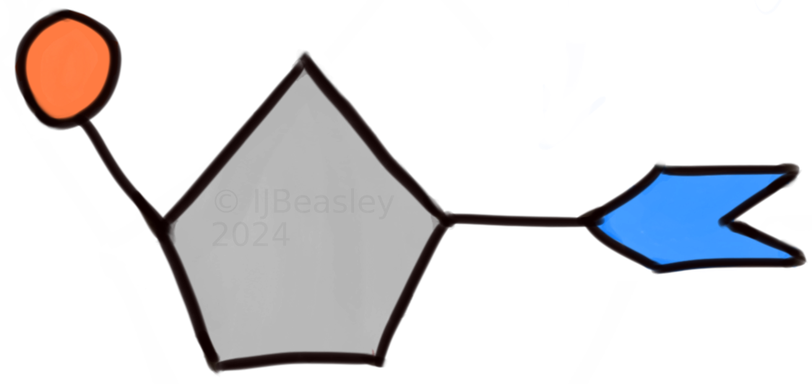
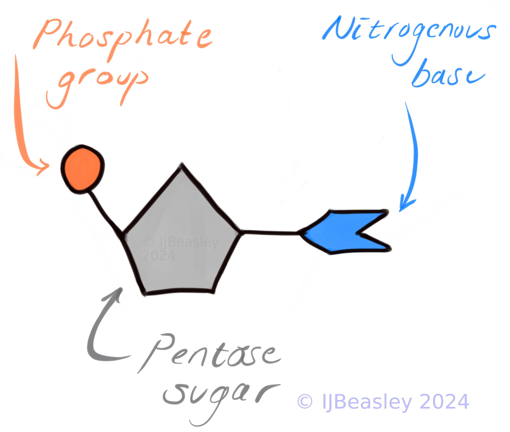
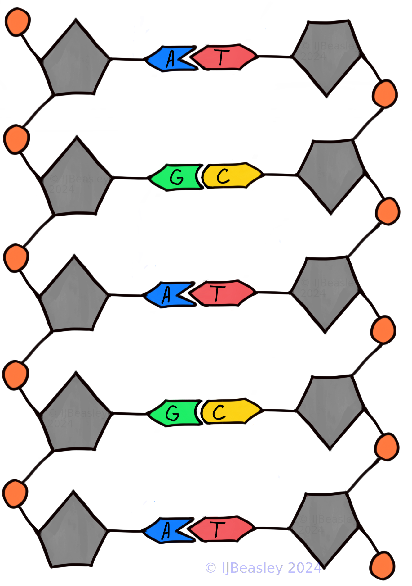
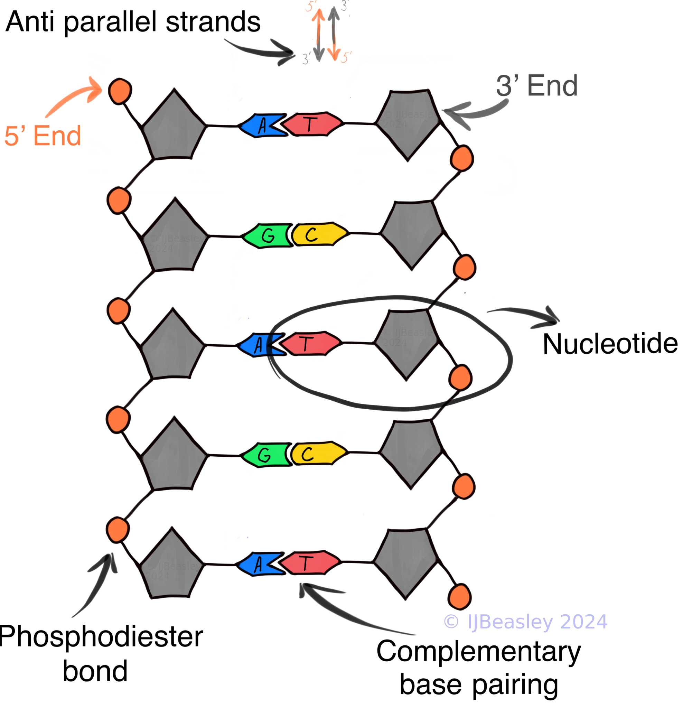

<h1 style="color:#D32F2F"> Content Overview </h1>

- [DNA Introduction](#dna---the-miracle-molecule-of-life)
- [DNA Nucleotides](#the-nucleotide)
- [DNA - The Helix And The Polymer](#dna-as-a-doubled-stranded-polymer)
- [RNA Vs DNA](#rna---a-molecule-of-many-kinds-and-many-jobs)
- [TL;DR](#todays-tldr)
- [Extra Resources](#extra-resources)

 

<h2 style="color:#D32F2F">
Relevant VCAA 2022-2026 Study Design Dot Points:    
</h2> 

<aside>
💡 Associated VCAA (2022-2026) Study Design Dot Points:                 
<ul> <i> 
<li> 
Nucleic acids as information molecules that encode instructions for the synthesis of proteins: the structure of DNA, the three main forms of RNA (mRNA, rRNA and tRNA) and a comparison of their respective nucleotides
</li> 
</i> </ul> 
</aside>

<h2 style="color:#D32F2F"> Learning Objectives: </h2>

*By the end of this session you should be able to:* 

- Describe the general role of DNA, and the three main forms of RNA
- Draw the basic structure of DNA (nucleotides, and the polymer strands)
- List the major similarities and differences between DNA and RNA (focusing on subunits, structure and function)

  

# DNA - The Miracle Molecule of Life 

Genetic science has infiltrated popular culture to such a degree I suspect that the first time you heard the word DNA was long before your first biology class. Perhaps you had even seen DNA's spiral structure (called a helix) before you learned what the DNA acronym stood for (<b>D</b>eoxyribo<b>N</b>ucleic <b>A</b>cid - btw).

We will use more technical language and learn more specific information about the function and structure of DNA than any mainstream TV show. However, I hope you keep your prior knowledge of genetic science in mind as we go along; it will help you pick up this information more quickly and improve your motivation to study when the concepts start to feel more abstract. 

For this reason, let's start by considering the purpose of DNA. Parts of your DNA were passed down to you from your biological parents, and much of it is shared with other humans and living beings. But more is needed to explain DNA's function: <b> why do we, and most other organisms, have DNA? What is its function? </b>

[Add your own answer to the set of anonymous student responses below](
https://PollEv.com/discourses/ODZWtjez9nXfAgQesfr9N/respond)

 

  <iframe 
    src="https://embed.polleverywhere.com/discourses/o7pm8rXqTyTr8dFpp0Vw2?controls=none&short_poll=true" 
    style="position: absolute; top: 0; left: 0; width: 100%; height: 100%; border: 0;" 
    allowfullscreen>
  </iframe>

  
 
 

 
 Reveal a tutor's response to the question: <b> 'What role does DNA play in the cell or organism?' </b> 
 

<ul>
<li> Encode for all proteins the cell/organism needs to function; this encoding includes the specific sequence of amino acids that comprise this protein, and when/where this protein is expressed (what cells, environmental conditions etc.)
</li>
<li> Through reproduction, DNA facilitates the transmission of this genetic protein blueprint from one generation to another. 
</li>

 

<!-- <h2 style="color:#D32F2F"> An introduction to DNA and its features by Khan academy </h2> !-->
<h2 style="color:#D32F2F"> Khan Academy: An Introduction to DNA and Its' Features </h2>

  <iframe 
    src="https://www.youtube-nocookie.com/embed/_-vZ_g7K6P0?si=IOEBW9XgpKdTa1Zs" 
    title="YouTube video player" 
    style="position: absolute; top: 0; left: 0; width: 100%; height: 100%; border: 0;" 
    allow="accelerometer; autoplay; clipboard-write; encrypted-media; gyroscope; picture-in-picture; web-share" 
    allowfullscreen>
  </iframe>

 

<!-- <iframe width="560" height="315" src="https://www.youtube-nocookie.com/embed/_-vZ_g7K6P0?si=IOEBW9XgpKdTa1Zs" title="YouTube video player" frameborder="0" allow="accelerometer; autoplay; clipboard-write; encrypted-media; gyroscope; picture-in-picture; web-share" allowfullscreen></iframe> !-->

 
DNA: Khan Academy Video 

  
 
 

# The Nucleotide 

Every DNA molecule is made up of many smaller subunit molecules called 'nucleotides'. You need to know the key features of nucleotides (and how to depict them in exams!) because they ultimately give rise to DNA's structure and properties.

 

<b> What are the key components of DNA nucleotides? </b> <i> (i.e. what do I need to be able to draw in an exam or test?) </i> </b>

 
         
 Unlabeled diagram hint 

 

 
         
 Reveal key components 

<ul>

<li>
<b>Phosphate Group </b>
  
The phosphate group is negatively charged. <b> We typically draw the phosphate group as a circle in a rough diagram.</b> 
 
 
</li>

<li>
<b> Nitrogenous Base  </b>
 
In rough <b> diagrams </b> (like the ones you might draw in an exam), <b> a Nitrogenous base is typically depicted as a rectangle with a triangular or circular end</b>. 

 
 
We typically draw triangular or circular ends to show complementary base pairing. For instance, C / G bases could have complementary circular patterns, and A / T bases could have complementary triangular patterns. 

 
 
You don't have to stick to this depiction of nitrogenous bases if you don't want to. The critical aspect to capture in your diagrams is that the A / T bases look like they fit together, the C / G bases have a different shape to the A / T bases, and the C / G bases look like they fit together. The particular shape (e.g. triangles, circles) you draw to show complementary base pairing is unimportant. 

  
 
</li>

<li>
<b> Deoxyribose Sugar  </b>
 
 In a rough <b> diagram, we typically use a pentagon to represent the deoxyribose sugar </b>, as this sugar molecule typically has a '5' carbon ring. 
 
 
 
</li>

<li> 
<b> Hydroxyl group </b> 
 
This is typically not as important for the budding biologist's out there, as the hydroxyl group is rarely depicted in rough diagrams. I've included it here for completeness sake - especially since it is this hydroxyl group (-OH) that enable nucleotides to bind to each other to form a single strand of DNA (more on this below!). 
</li>
</ul>

 

  
 

# DNA as a doubled stranded polymer 

The final <b> DNA structure is called a helix; it looks a little like a spiral staircase </b>. But how and why exactly does it form this helical shape? 

 
 
<b> How do DNA nucleotides become the double stranded DNA helix? </b>  

 
A single strand of DNA is formed via <b> condensation polymerisation</b>. Nucleotides are added together to form the phosphodiester backbone. This bonding procress releases a water molecule as a by-product (which is why it is called, <i> condensation </i> polymerisation). 

 
 
Once this single strand is formed, a complementary strand can now anneal to it using a type of hydrogen bonding known as <b> complementary base pairing </b>. 

 
 
The annealing of two complementary strands of DNA ultimately gives it a helical shape. More precisely, after some time, the repulsive forces of the negatively charged backbones of each strand and the attractive forces of 'complementary base paring' will reach a kind of balanced state, where parts of the DNA molecule that are attracted to each other are as close to each other as they can be without forcing parts of the molecule which are repelled to be very close. Remarkably, this balancing act results in the spiral shape we know and love!

 

  

<h2 style="color:#D32F2F"> The features of DNA as a doubled stranded polymer </h2> 

  <iframe 
    src="https://www.youtube-nocookie.com/embed/7Hk9jct2ozY?si=tUbFraR6Ku0iJxLK"
    title="YouTube video player" 
    style="position: absolute; top: 0; left: 0; width: 100%; height: 100%; border: 0;" 
    allow="accelerometer; autoplay; clipboard-write; encrypted-media; gyroscope; picture-in-picture; web-share" 
    allowfullscreen>
  </iframe>

  
Animation depicting the location and structure of DNA: WEHI TV 

  

Because DNA is <b> made of numerous repeating subunits (nucleotides), it is considered a polymer </b>. As a polymer, DNA has some features that its' subunits do not.

<b> What are the key features of the DNA Polymer? </b> <i> (i.e. what features do I need to be able to draw/depict in exam?) </i> 

 
 Reveal key features of the DNA Polymer 

<ul>
<li>
<b> Nucleotides </b>  
<i> The repeating subunits (aka, monomers) of DNA. </i>  
Depict them with all their components as suggested earlier above - just make sure to make them looked joined together in a single strand (see the below description of the phosphodiester backbone for more information). 
 
 
</li>
<li>
<b> Phosphodiester backbone </b>  
<i> Alternating sugar and phosphate groups, which form the structural framework of the DNA strand. </i>  
Depiction in rough diagram: A continuous zigzag line, which connects the bases in one strand to each other. 
 
 
</li>
<li>
<b> Complementary Base Pairing </b>   
<i> Two DNA strands are held together by hydrogen bonds between complementary nitrogenous bases: adenine pairs with thymine (A-T), and cytosine pairs with guanine (C-G).  </i>   
Depiction in rough diagram: As you would for nitrogenous bases if you were just drawing DNA nucleotides (see above information). The added information to include is two parallel strands with A-T and C-G pairs connected by dashed lines (hydrogen bonds) between them.
 
 
</li>
<li>
<b> Antiparallel strands </b>  
<i>
The two strands of DNA run in opposite directions, meaning one strand runs 5' to 3' and the other runs 3' to 5' (the prime numbers refer to the number the carbon in the pentose is given). 
</i> 

Depiction in rough diagram: Make sure one strand looks flipped upside down. One strand should have the 5' end at the top of the page (which is where the phosphate group is), and the other strand should have the 3' end at the top of the page (just where the flat bottom of the pentagon is).  
</li>
</ul> 

 

  
  
    
# RNA - a molecule of many kinds and many jobs 

<b> In Eukaryotic organisms, DNA resides in the cell's nucleus</b>,<b>is very stable and long-lived</b>. DNA needs to be so long-lived because its' role is to remain an accurate, official record of all the proteins an organism (or cell) can make. 

Comparatively, RNA is a <b> short-lived </b> molecule that is <b> more easily transported throughout </b> the cell. 

<b> There are three main classes of RNAs </b> you should know about, each with different roles: 

<ul> 
<li><b>mRNA:</b> <i>to carry information from the nucleus to the ribosome for protein synthesis</i></li>
<li> <b> rRNA: to be a <i> structural component of the ribosomes </i> </b> and catalyse the assembly of amino acids into protein chains  </li>
<li><b>tRNA:</b> <i>to carry specific amino acids to the ribosome for protein synthesis</i></li>

<!-- <li> <b> mRNA: <i> "to carry specific amino acids to the ribosome for protein synthesis” </i> </b> (definition taken from prior VCAA examiners report) </li> !-->
<!-- <li> <b> tRNA: <i> to carry information from the nucleus to the ribosome for protein synthesis </b> </i> (definition taken from prior VCAA examiners report) </li> !-->
</ul> 

 
  

<h2 style="color:#D32F2F"> RNA nucleotides </h2> 

Like DNA, RNA is comprised of nucleotides. However, the nucleotides found in RNA are a little different to those found in DNA. 

<b> What are the key differences between the nucleotides of RNA and DNA? </b> 

 Reveal the key differences between RNA and DNA nucleotides

<ul>
<li>
<b> Different Nitrogenous Bases </b>
  
<i> RNA has A, U, G, C and DNA has A, T, G, C. </i>

When drawing this in an exam, remember this change affects what bases should look complementary to each other!
  
</li>
<li>
<b> Different Sugar Type </b>   
<i> RNA has a ribose sugar, DNA has a dexoyribose sugar. </i> 

Both of these sugars tend to be pentose shaped (so drawing a pentose for either of these sugars is good). The ribose sugars just has one more oxygen than the deoxyribose sugar found in DNA nucleotides, which makes the ribose molecule less stable than the deoxyribose molecule. 
</li> 
</ul> 

 
 

<h2> Now let's summarise and test our knowledge, what are the key differences between RNA and DNA? </h2>

Submit your own answers or guesses [here](https://PollEv.com/discourses/W8DoB505sWqCCltXcaPyY/respond).

 

 
 Reveal how students have responsed previously 

  <iframe 
    src="https://embed.polleverywhere.com/discourses/bnf9RhrM1atuCpYsq5P2E?controls=none&short_poll=true"
    style="position: absolute; top: 0; left: 0; width: 100%; height: 100%; border: 0;" 
    allowfullscreen>
  </iframe>

<!-- <iframe src="https://embed.polleverywhere.com/discourses/bnf9RhrM1atuCpYsq5P2E?controls=none&short_poll=true" width="800px" height="600px"></iframe> !-->

 

  

    

# Today's TL;DR

- DNA is a super cool molecule that makes all of life possible, by encoding for all the proteins organisms need to function
- The subunits of DNA (called <b>nucleotides</b>) <b>are comprised of a phosphate group, deoxyribose sugar, nitrogenous base and a hydroxyl group</b>
- <b>DNA is a double-stranded, antiparallel polymer</b> of nucleotides
- In comparison, <b>RNA is single-stranded</b>, and while it is also a polymer of nucleotides, <b>RNA's nucleotides have a ribose sugar</b>, rather than a dexoyribose sugar, and <b>Uracil rather than Thymine</b> nitrogenous bases

  

# Extra Resources

## Douchy's VCE Biology Podcast

<iframe style="border-radius:12px" src="https://open.spotify.com/embed/episode/3k6dFRu1XPmQObB1U8UjhM?utm_source=generator" width="100%" height="352" frameBorder="0" allowfullscreen="" allow="autoplay; clipboard-write; encrypted-media; fullscreen; picture-in-picture" loading="lazy"></iframe>

