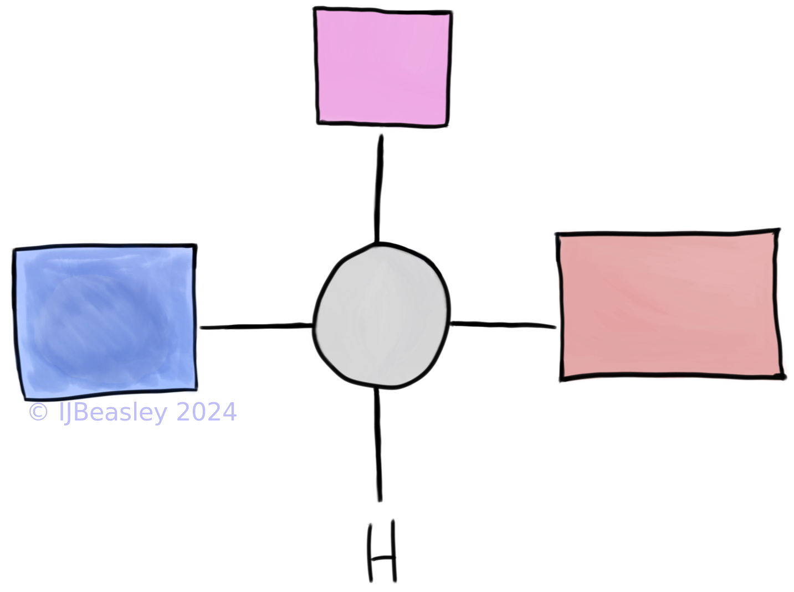
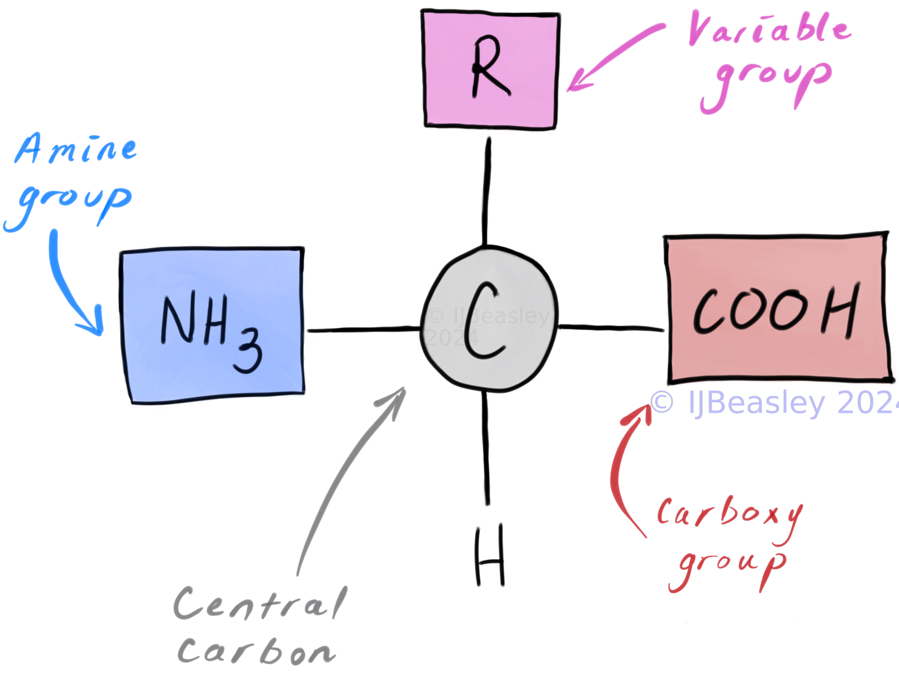

## Overview 

- [The Structure of Proteins](#the-structure-of-proteins)
   * [Amino Acids ](#amino-acids)
   * [From amino acids to protein: the hierarchy of protein structure](#from-amino-acids-to-protein-the-hierarchy-of-protein-structure)
- [The varied roles of proteins](#the-varied-roles-of-proteins)
   * [What is the proteome?](#what-is-the-proteome)
   * [What are some of the proteins which make up the proteome?](#what-are-some-of-the-proteins-which-make-up-the-proteome)
- [TL;DR](#todays-tldr)
- [Extra Resources:](#extra-resources)

 

<aside>
💡 Associated VCAA Study Design Dot Points (2022 - 2026):               
  
<ul> <i> 
<li> 
amino acids as the monomers of a polypeptide chain and the resultant hierarchical levels of structure that give rise to a functional protein
</li> 
<li> 
proteins as a diverse group of molecules that collectively make an organism’s proteome, including enzymes as catalysts in biochemical pathways
</li> 
</i> </ul> 
</aside>

  
 
  

<h2 style="color:#D32F2F"> Learning Objectives: </h2>

*By the end of this session you should be able to:* 

- Draw the basic structure of an amino acid
- Define what constitutes each level of protein structure hierarchy (primary, secondary, tertiary, and quaternary)
- (Depending on your prior knowledge) Give (at least three) examples of roles proteins play

Bonus Learning Objectives: 

- Bonus Easy:  Agree that proteins do many varied and important things for cells *and therefore you!*

 
 
  

# The Structure of Proteins

## Amino Acids 

Proteins are comprised of many smaller molecules called amino acids. More precisely, a polypeptide is a polymer or chain of amino acids. Once folded into a functional 3D shape, this polypeptide is now considered to be a protein. 

You need to know the key features of amino acids (and how to depict them in exams!) because they ultimately give rise to the structure and properties of proteins. 

Thankfully, (for the purposes of VCE Biology) you won't need to be able to draw and list out all the elements like you might need to in a chemistry class. Instead, let's focus on knowing the 4 key components of amino acids. 

 

<b> What are the key components of amino acids? </b> <i> (i.e. what do I need to be able to draw?) </i> 
 
 
<ul> 
<li>
Variable group (also sometimes referred to as the R group)
</li>
<li> Amino group 

Not the most important distinction, but its worth noting that in some cases you may see this referred to as an amine rather than amino group.
I believe both names are correct, but amino is more precise (see, discussion under [What is an Amino Functional Group? on ChemTalks](https://chemistrytalk.org/amino-functional-group/)).

</li>
<li> Carboxylic acid (aka, Carboxyl) group
</li>
<li> 
Central Carbon and Hydrogen 
(these are generally less important components to label when drawing out a diagram of an amino acid - but I list them here because you do still need to draw them!)
</li>
</ul> 

 

 
 Considering the above key components, <b> can you make an educated guess: why do we call amino acids, <i> amino acids? </i> </b> 

 
 'Amino' - comes from the fact there is amino group!
 'Acid' - comes from the carboxylic acid group!
 
  Keep this information in mind if you're ever asked to draw an amino acid - the name already tells you 2 of the key components to draw and label!
 
 

 
  
  

<h2 style="color:#D32F2F"> The many different kinds of amino acids </h2>

20 different amino acids are needed to build all the proteins needed by the human body. 

 
 These amino acids are: 

alanine, arginine, asparagine, aspartic acid, cysteine, glutamic acid, glutamine, glycine, histidine, isoleucine, leucine, lysine, methionine, phenylalanine, proline, serine, threonine, tryptophan, tyrosine, and valine

.

The chemical structure of each of these amino acids is similar; only one key components differs between different amino acids. 

 
 
 Which key components react to form a chain of amino acids in a protein? 

 
 The amine group and the carboxylic acid group 
 
 

  

  
 Which key component is different for each amino acid? 

  
  The variable group! All other components are the same across all amino acids. 
  

 
  
 Do different amino acids have different properties? 

  
  Yep! While all amino acids can be used to build proteins, their variable or R group has different elements and structures with different properties!
  
    
  For example, some variable groups are hydrophilic and others are hydrophobic. 
  These variable groups will thus interact differently with polar molecules - and the corresponding amino acids will have different properties / functions. 
  

 
 

<h2 style="color:#D32F2F"> Practice drawing an amino acid diagram </h2>

Now, let's draw and label the key components of amino acids. 

Here's an unlabeled diagram of an amino acid to help you get you started:

  
 Amino acid diagram with key components labelled 

  
  

 
 

## From amino acids to protein: the hierarchy of protein structure level

When we investigate the structure of a protein, there are four different levels of detail / information we can look at: primary, secondary, tertiary, quaternary. 

We can learn different things from considering / investigating any one particular level of protein structure. 

Tertiary and quaternary structure for instance, can be really important for understanding protein binding. 

1. 
 
 Primary: 

    The linear order/sequence of amino acids formed by covalent peptide bonds between adjacent amino acids.

 

2. 
 
 Secondary: 
    
   <b> VCAA 2013: <i> “the coiled or pleated structure within the chain (including α-helices and β-pleated sheets)” </i> </b> 
   <ul> 
   <li> 
   caused by hydrogen-bonding between -C=O and -N-H groups (peptide linkages) within the amino acid chain
   </li>
   </ul>

3. 
 
 Tertiary: 
 
   <b> VCAA 2013: <i> “Tertiary structure: A 3D structure composed of secondary structures” </i> </b> 
    <ul>
    <li>
     formed through the interactions of various ‘R’ groups within the molecule
    </li>
    <li>
    the function of a protein is determined by its 3D structure, the tertiary structure of a protein is essential to its functioning. If the protein is reshaped in any way, the protein may no longer be able to do its job. 
    </li>
    </ul>

 
    
    
4. 
 
 Quaternary: 

    <b> VCAA 2013: </i> “Quaternary structure: Two or more polypeptide chains joined together” </i> </b> 
    
 

  
 

## Schematic diagrams of protein structure 

Now that we know the definitions of each level of protein structure, let's practice drawing a schematic diagram for each level of protein structure.
This kind of drawing is unlikely to come up in the VCE Biology final exam, but can really help make sense of the various definitions so it's still a useful exercise!

 
      
 Primary structure diagram 
 

 
      
 Secondary structure diagram 
 

 

 
       
 Tertiary structure diagram 

 
      
 Quaternary structure diagram 
 

 
 
 

# The varied roles of proteins

(i.e. the proteome)

 

## What is the proteome?

The entire set of proteins expressed by an organism (for more information, see the definition on [scitable](https://www.nature.com/scitable/definition/proteome-297/)). 

 

## What are some of the proteins which make up the proteome?

Can you name some kinds of proteins? What are their roles?

 
 Here's some examples to get you started if you need: 
 

<ul>
<li>
Enzymes, see the <a href="../movement-across-a-membrane">relevant VCE Biology Notes page for more information</a>

<!--Enzymes, see the [relevant VCE Biology Notes page for more information](../movement-across-a-membrane) !-->
</li>
<li>
Channel proteins, see the <a href="../intro-enzymes">relevant VCE Biology Notes page for more information</a>
</li>
<li>
Antibodies, see later information on immunity 
</li> 
<li>
Complement proteins, see later information on immunity
</li>
</ul>

Don't worry if you can't yet answer these questions easily; you undoubtedly will once you've progressed further in the course and have learnt more about the above proteins. 

Just make a note to come back when you do, and check that you can now answer the questions!

 
  

# Today's TL;DR

- Proteins are 3D folded structures (called 'polymers') comprised of smaller repeating subunits (amino acids)
- Amino acids are comprised of a central carbon (and hydrogen), a variable group, a carboxylic acid group and an amino group
- The 3D shape and the amino acids that make up each protein determine what it can bind to, and thus this proteins function!

 
 

# Extra Resources

## Douchy's VCE Biology Podcast

<iframe style="border-radius:12px" src="https://open.spotify.com/embed/episode/5qT2Ez7aUA29lPRSeacNPW?utm_source=generator" width="100%" height="352" frameBorder="0" allowfullscreen="" allow="autoplay; clipboard-write; encrypted-media; fullscreen; picture-in-picture" loading="lazy"></iframe>
