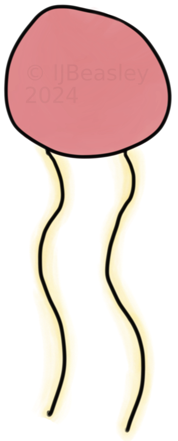
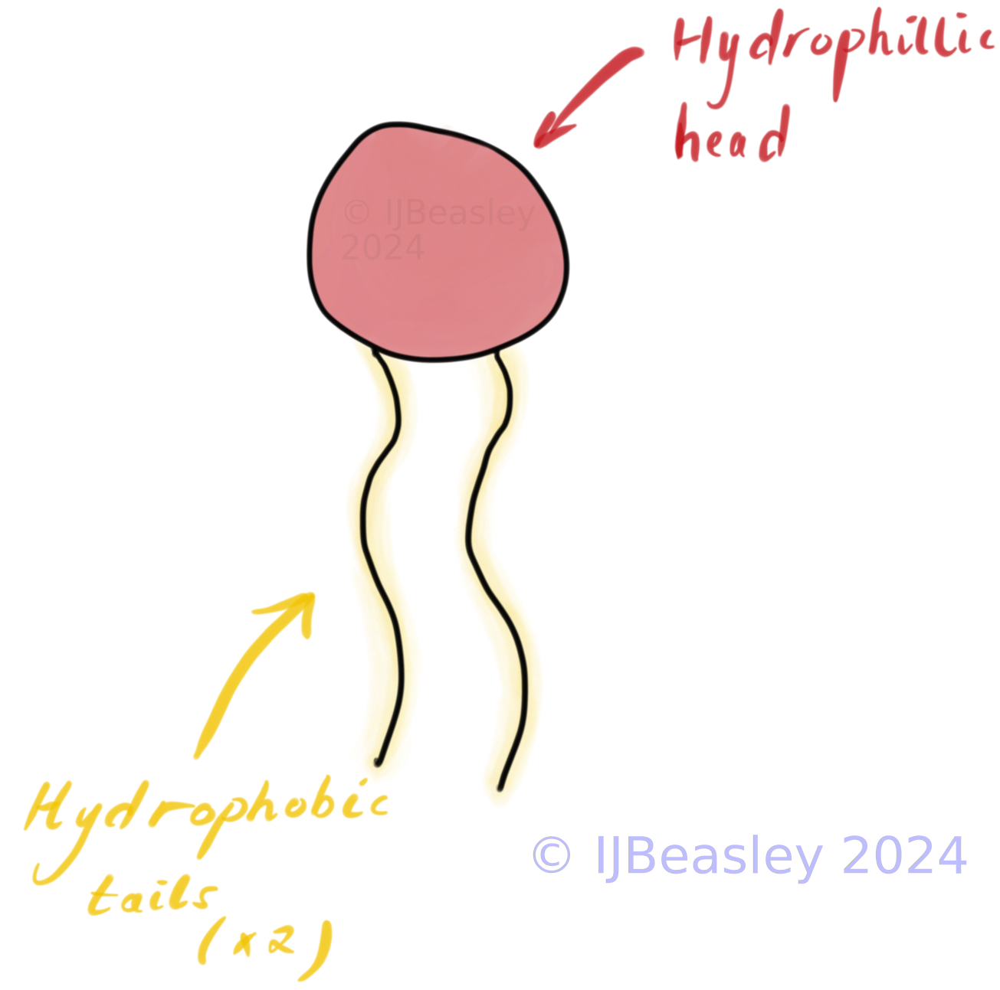
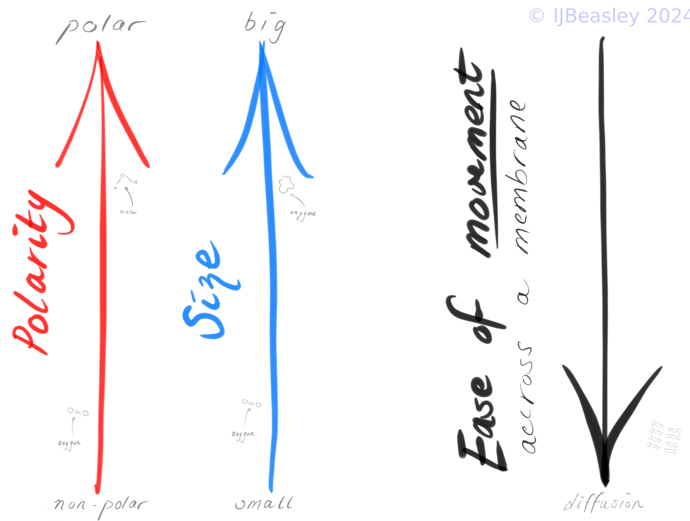

<h2 style="color:#D32F2F">
Relevant VCAA 2022 Study Design Dot Points:    
</h2> 

<aside>
<b> Unit 1 (Area of study 1): Cellular structure and function </b>
<ul>
<li>
<i> the structure and function of the plasma membrane in the passage of water, hydrophilic and hydrophobic substances via osmosis, facilitated diffusion and active transport </i>
</li>
</ul>
</aside>

<b> Note: </b> 

I find students often struggle to apply their knowledge in this topic area to molecules they haven't encountered before. Such students have memorised but not understood the methods of membrane transport (osmosis, facilitated diffusion, active transport, etc.). 

I hope to encourage you to instead focus on understanding *why* and *when* particular substances are likely to use one particular kind of transport across the membrane - as this will let you apply your knowledge to a broader range of questions! For this reason, here I focus on the structure and function of the plasma membrane, and mostly neglect to define the kinds of membrane transport. 

  

<h2 style="color:#D32F2F"> Introduction to Membrane Transport </h2>
 
How do smaller molecules get into and out of the cell? 

<!--

-->
 
...Well, through the plasma membrane, of course! 

But not every small molecule, across every time / context will travel through the plasma membrane in the same way. Some small molecules travel directly in between the phospholipid molecules, some travel across the membrane with a little help from a protein, others need an energy (ATP) boost to make their way into or out of the cell. 

 
 The structure of plasma membranes are often described a ‘fluid-mosaic’. Why? 

<ul>
<li>
The membrane is fluid, that is the phospholipid bi-layer is able to move and reform 
</li>
<li>
The membrane is a mosaic, that is it is comprised of many different components (e.g. interspersed within the phospholipid bi-layer are cholesterol molecules, protein channels etc.)
</li>
</ul> 

 
 
 

<h2 style="color:#D32F2F"> Structure of the plasma membrane </h2>

<h3> Drawing Time (~20 mins) </h3>

For VCE Biology final exams or SACs you may need to draw a plasma membrane, and in particular the phospholipids which comprise most of the plasma membrane. On a piece of paper, or an electronic whiteboard, let's draw these important features together. 

<h3> Questions to check you know how to draw the important features questions: </h3>

<b> What are the important features of phospholipids to draw? </b>

 
         
 Unlabelled diagram hint 

         

 
         
 Final labelled diagram solution 

Phospholipids need their hydrophilic head and 2 hydrophobic tails. 

 

 
<b> What might be some important features of the plasma membrane to draw? </b>

 
         
 Unlabeled diagram hint 

  
 
   

   

 
         
 Final labelled diagram answer 

                  
 

      
    
 

 
         
 

<h2 style="color:#D32F2F"> From Structure to function </h2>

 
        
 Why are these features important? 

<ul>
<li> The tails are repelled by water (hydrophobic), so they form the distinctive *'bi-layer'* of the membrane (i.e. the two layers of phospholipids which make up the plasma membrane). </li>

<li>The tails then become part of the centre of the plasma membrane - which repel hydrophilic substances.  </li>
<li> This structure means the plasma membrane is <b> 'selectively permeable' - i.e. it regulates the movement of substances into and out of the cell. </b> </li>
 
</ul>

    
 How do these features impact what is able to easily cross membranes - and what isn't? 

<ul>
<li> Because the plasma membrane is selectively permeable, only some substances can cross the membrane with ease. Others have a more difficult time. </li>
<li> How easy or difficult a substance finds crossing the membrane through jumping between the phospholipids is due to the <b> size of the gaps between phospholipids </b> and  <b> whether the substance is repelled by the tails </b>  </li> 
</ul>
 

 
 
 

<h2 style="color:#D32F2F"> Movement Across a Membrane (~20 mins) </h2>

                  
 
                  
There are three factors which impact how easily a substance is able to cross a membrane:

 

 
         
 <b> Size 💢 </b> 

- Smaller substances can fit between the gaps in phospholipids - and don't need a protein helper.
- Big substances need a larger gap, which can be created by a protein channel or gate.

         
 <b> Polarity 🎣 </b> 

- Non-polar (hydrophobic) molecules are not repelled by the phospholipid tails - and thus don't need a protein helper.
- Polar (hydrophilic) molecules are repelled, and need a protein helper (like a channel or gate) to shield them

 <b> Concentration Gradient 🏔️ </b> 

- Natures tendency is for substances to move from high to low concentrations.
- Energy is required if we are to go in the opposite direction of nature / concentration gradient
- Protein helpers are needed to get ATP converted to ADP + Pi at the right place and time (when going against the gradient)

 

 

These factors, in combination, determine whether a substance can just pass directly across a membrane, or whether it needs some extra protein help. Bigger substances (e.g. proteins) or large groups of substances typically use vesicles to get into and out of the cell. 

When your teacher or VCAA asks you to predict the type of transport for substance, or explain why a particular substance travels in a particular method - you need to *include all three components in your answer.* 

 
 
 

<h2 style="color:#D32F2F">  The Movement Equation (Test) </h2>

Predict how likely a given substance is to directly cross the plasma membrane given the following equations. Explain why using the three major components impacting movement across a plasma membrane listed above. 

1. Example: Nitrogen Gas

$$ \text{Small size} + \text{Non-Polar} + \text{With the concentration gradient} = $$

 
 
 Answer: 

  Nitrogen gas is likely to directly pass through the membrane without needing protein help, as it is small, non-polar and travelling from an area of high to low concentration (of nitrogen). 
  
  For reference, this process of directly travelling through the plasma membrane in the direction of the concentration gradient is called: 'simple diffusion'. 
  

2. Example: Carbon Dioxide

$$\text{Small Size} +  \text{Non-polar} + \text{Against the concentration gradient} = $$

 
 
 Answer: 

  Even though Carbon Dioxide is small and non-polar (like in the last example) it is moving against the concentration gradient. Thus, in this example, Carbon Dioxide needs membrane transport proteins to provide the energy needed to move across the membrane (i.e. 'active transport') - so it is not directly moving across the membrane.
  
  Importantly: this answer would be different if Carbon Dioxide was moving with the concentration gradient (it would be simple diffusion). 
  

  
3. Example: Water

$$\text{Small Size} + \text {Polar} + \text{With the concentration gradient} = $$

 
 
 Answer: 

  Even though water is polar, it is small enough to pass through the membrane directly. However, this process is slow (because water is polar!), so channel proteins called aquaporins often help water across the membrane. 
  
  The process of water moving with the concentration gradient has a special name: osmosis. 
  

4. Example: Ethanol

$$ \text{Small Size +}\text{Mostly non-polar} + \text{With the concentration gradient} = $$

 
 
 Answer: 

  Ethanol will generally pass directly through the plasma membrane (simple diffusion).
  

5. Example: Protein 

$$ \text{Massive size + Polar} + \text{With the concentration gradient } = $$

 
 
 Answer: 

  Proteins are really big molecules, so regardless of whether they are moving with or against the concentration gradient, they will not move directly through the plasma membrane. Instead, proteins will tend to move in and out of cells using vesicles (through endocytosis and exocytosis respectively). 
  

 
 
 

         

<h2 style="color:#D32F2F">  This lesson's TL;DR </h2>

- The plasma membrane is responsible for the regulation of substances into and out of the cell (it is selectively permeable)
- Phospholipids have a specialised structure; their structure makes it easier for small and non-polar molecules to cross the membrane, as they can directly pass through

 

# Extra Resources 

##   Douchy's VCE Biology Podcast   

<iframe style="border-radius:12px" src="https://open.spotify.com/embed/episode/525829G1DbWywwT2ZIV3Lv?utm_source=generator" width="100%" height="352" frameBorder="0" allowfullscreen="" allow="autoplay; clipboard-write; encrypted-media; fullscreen; picture-in-picture" loading="lazy"></iframe>
